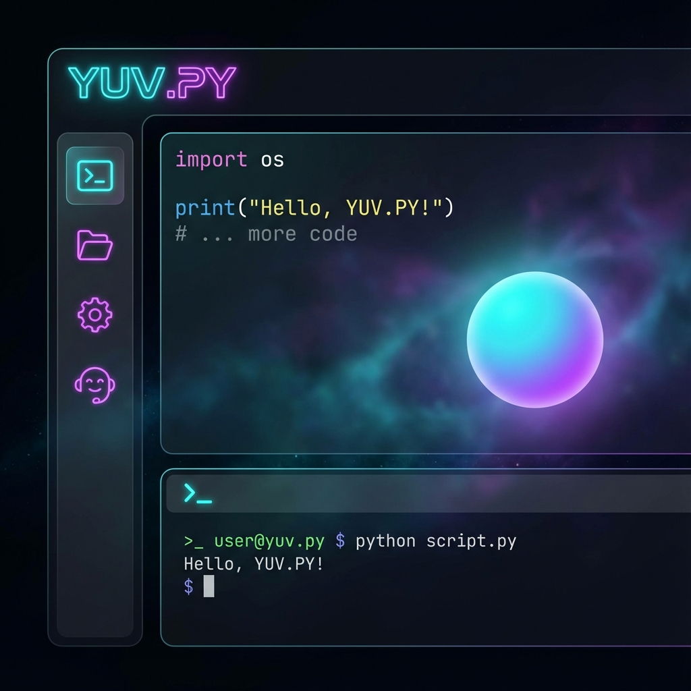
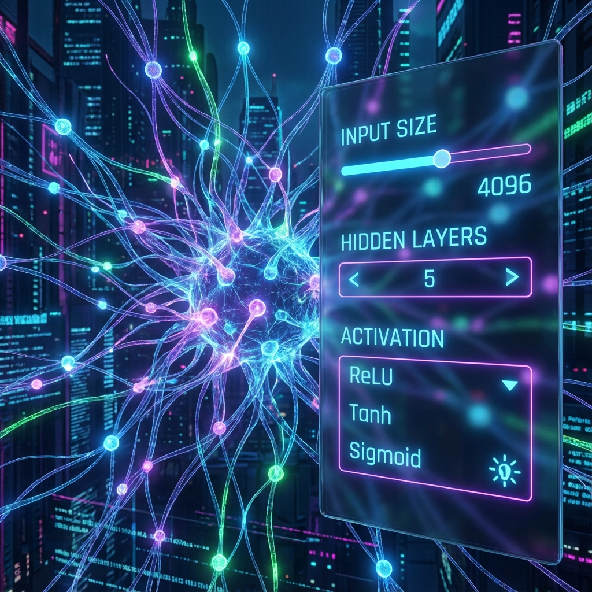

# YUV.PY // Future Terminal

**YUV.PY** is a futuristic, browser-based Python environment powered by WebAssembly (Pyodide). It brings the power of Python directly to your browser with a stunning, sci-fi inspired interface.

## 🚀 Features

### 🐍 Python in the Browser
Run real Python code instantly without any server-side setup. Powered by WebAssembly, YUV.PY delivers near-native performance right in your client.

### 🧠 Neural Network Builder (NEW!)
Visually design and build neural networks with our new **No-Code Builder**.
- **Visual Interface**: Add/Remove layers, configure sizes, and select activation functions (ReLU, Sigmoid, Tanh).
- **Live Visualization**: See your network architecture updates in real-time with our dynamic particle system.
- **Code Generation**: Automatically generate production-ready code for **PyTorch** and **TensorFlow**.
- **Browser Simulation**: Run a "Pure Python" simulation of your network directly in the terminal to see it learn!

### 📱 Mobile Ready
Now fully optimized for mobile devices. Code on the go with our responsive design and touch-friendly interface.

### ⚡ Templates
Start quickly with built-in templates:
- **Algorithms**: Fibonacci, Sorting
- **Data Structures**: Lists, Dictionaries, Sets
- **Advanced Python**: Decorators, Generators, Comprehensions
- **AI/ML**: Neural Networks

## 🛠️ Usage

1. Open `index.html` in any modern web browser.
2. Select a template from the sidebar.
3. Click the **Builder** button (in Neural Net mode) to customize your AI model.
4. Click **Run** to execute the code.

## 📦 Tech Stack

- **Core**: Vanilla JavaScript, HTML5, CSS3
- **Runtime**: Pyodide (WebAssembly)
- **Design**: Glassmorphism, Neon Effects, Responsive Grid

## 📸 Screenshots

*The main futuristic terminal interface.*

*The new visual Neural Network Builder.*

*Fully optimized mobile experience.*

---

*Created by Yuval Avidani - YUV.AI*
